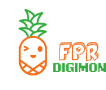

# FPR Digimon - Aplicação de Exploração do Universo Digimon

<div align="center">
  
</div>

## 📋 Sumário

- [Sobre o Projeto](#-sobre-o-projeto)
- [Tecnologias Utilizadas](#-tecnologias-utilizadas)
- [Arquitetura e Estrutura](#-arquitetura-e-estrutura)
- [Funcionalidades](#-funcionalidades)
- [Temas Personalizados](#-temas-personalizados)
- [Como Executar](#-como-executar)
- [Considerações sobre o Projeto](#-considerações-sobre-o-projeto)
- [Melhorias Futuras](#-melhorias-futuras)

## 🌟 Sobre o Projeto

FPR Digimon é uma aplicação web que permite aos usuários explorar o universo Digimon, buscar informações sobre seus Digimon favoritos, e personalizar a experiência através de diferentes temas baseados nos emblemas do anime. A aplicação permite:

- Buscar Digimon por nome
- Visualizar todos os Digimon existentes com filtragem por nível
- Selecionar um Digimon favorito que fica salvo durante a sessão
- Personalizar a interface com diversos temas inspirados nos emblemas Digimon

## 🛠️ Tecnologias Utilizadas

- **Next.js 15**: Framework React com renderização do lado do servidor
- **React 19**: Biblioteca para construção de interfaces
- **TypeScript**: Tipagem estática para JavaScript:
  -Porque?

  - Eu escolhi TypeScript em vez de Java para o FPR Digimon porque faz mais sentido para um aplicativo web. TypeScript me dá o equilíbrio ideal entre segurança de tipos e produtividade, além de se integrar perfeitamente ao ecossistema React/Next.js que estou usando.
    Outra grande vantagem é a facilidade de criar uma experiência de usuário fluida e visualmente rica, especialmente com bibliotecas como Styled Components. Sem falar que o TypeScript reduz bugs, oferece um feedback de erros mais rápido e, na minha opinião, torna a refatoração muito mais simples.
    Com essa escolha, consigo aproveitar o melhor das ferramentas web modernas sem abrir mão dos benefícios de uma linguagem fortemente tipada, como o Java.

- **Styled Components**: Biblioteca para estilização com CSS-in-JS
- **Lucide React**: Biblioteca de ícones
- **API Digimon**: API pública para obter dados dos Digimon
- **Gerenciamento de Estado**: Contexto React para gerenciamento global de estado
- **LocalStorage**: Para persistência dos temas selecionados

## 🏗️ Arquitetura e Estrutura

O projeto segue uma arquitetura de componentes com separação clara de responsabilidades:

### Estrutura de Pastas

```
src/
├── app/               # Páginas da aplicação (Next.js App Router)
│   ├── page.tsx       # Página inicial
│   ├── all/           # Página de listagem de todos os Digimon
│   └── layout.tsx     # Layout compartilhado entre páginas
├── components/        # Componentes reutilizáveis
├── contexts/          # Contextos para gerenciamento de estado
├── hooks/             # Hooks personalizados
├── lib/               # Configurações e utilitários
├── services/          # Serviços de API
├── styles/            # Estilos globais e temas
└── types/             # Definições de tipos TypeScript
```

### Padrões de Projeto

- **Context API**: Utilizada para gerenciamento de estado global (temas e Digimon selecionado)
- **Custom Hooks**: Encapsulamento de lógica reutilizável
- **Componentes Funcionais**: Utilizados com Hooks React
- **Styled Components**: Para estilização com suporte a temas

## 💡 Funcionalidades

### Página Inicial

- Busca de Digimon por nome
- Seleção de Digimon favorito
- Acesso à página de listagem completa
- Seleção de temas

### Página de Listagem (All)

- Visualização de todos os Digimon disponíveis
- Filtro por nível (Fresh, In Training, Rookie, Champion, Ultimate, Mega)
- Busca por nome
- Paginação para facilitar a navegação
- Seleção de Digimon favorito

## 🎨 Temas Personalizados

A aplicação oferece 8 temas diferentes inspirados nos emblemas do universo Digimon:

1. **Padrão**: Tema verde claro e branco
2. **Esperança**: Tema verde
3. **Sabedoria**: Tema vermelho
4. **Confiança**: Tema roxo
5. **Coragem**: Tema azul
6. **Amizade**: Tema laranja
7. **Luz**: Tema rosa
8. **Amor**: Tema azul claro
9. **Sinceridade**: Tema rosa claro

Cada tema altera completamente a aparência da aplicação, incluindo cores, fundos e estilos dos elementos.

## 🚀 Como Executar

### Pré-requisitos

- Node.js (versão 18.18.0 ou superior)
- NPM ou Yarn ou Bun

### Instalação

1. Clone o repositório:

   ```bash
   git clone https://github.com/seu-usuario/fpr-digimon.git
   cd fpr-digimon
   ```

2. Instale o Next.js, React e React DOM:

   ```bash
   npm install next react react-dom
   ```

3. Verifique se o Next.js foi instalado corretamente:

   ```bash
   npm list next
   ```

   Você deverá ver algo como:

   ```
   └── next@15.2.4
   ```

4. Se necessário, instale as demais dependências do projeto:

   ```bash
   npm install
   ```

5. Execute o servidor de desenvolvimento:

   ```bash
   npm run dev
   ```

6. Acesse a aplicação em seu navegador:
   ```
   http://localhost:3000
   ```

### Build para Produção

```bash
npm run build
npm start
# ou
yarn build
yarn start
# ou
bun run build
bun start
```

## 💭 Considerações sobre o Projeto

### Responsividade

A aplicação foi desenvolvida com layout responsivo, adaptando-se a diferentes tamanhos de tela, desde dispositivos móveis até desktops.

### Acessibilidade

Foram implementados elementos de acessibilidade básicos como:

- Textos alternativos em imagens
- Contraste adequado entre texto e fundo
- Estrutura semântica de HTML

Desenvolvido com 💙 por Pedro Amante

